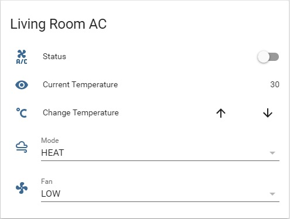

# I'M WORKING ON IT...


# home_assistant_custom_ac_alexa_smarthome_skill
Alexa smart home skill hosted on lambda servers for controlling a custom ir air conditioner build with [Home Assistant](https://home-assistant.io/) controls.</br>
You can check out the skill in action [here](https://www.youtube.com/edit?o=U&video_id=Y4i989zwQlc) and check out the ac unit control panel in home assistant [here](ha-ac.jpg).

**Table Of Contents**
- [Background](#background)
- [Obtain the IR packets](#obtain-the-ir-packets)
- [Configuring Home Assistant](#configuring-home-assistant)
  - [Preparing the configuration](#preparing-the-configuration)
  - [Creating the entities](#creating-the-entities)
    - [Fan control](#fan-control)
    - [Mode control](#mode-control)
    - [Temperature control](#temperature-control)
    - [Power control](#power-control)
    - [Disguising the temperature](#disguising-the-temperature)
      - [Template sensor](#template-sensor)
      - [Template cover](#template-cover)
    - [Grouping the controllers](#grouping-the-controllers)
    - [Customizing the entities](#customizing-the-entities)
  - [Incorporating the IR packets](#incorporating-the-ir-packets)
    - [Scripts](#scripts)
      - [Send ir packets to broadlink script](#send-ir-packets-to-broadlink-script)
      - [Scripts for constructing the ir packet](#scripts-for-constructing-the-ir-packet)
        - [Mode: COOL and Fan: LOW](#Mode:-cool-and-fan:-low)
        - [Mode: COOL and Fan: MED](#Mode:-cool-and-fan:-med)
        - [Mode: COOL and Fan: HIGH](#Mode:-cool-and-fan:-high)
        - [Mode: COOL and Fan: AUTO](#Mode:-cool-and-fan:-auto)
        - [Mode: HEAT and Fan: LOW](#Mode:-heat-and-fan:-low)
        - [Mode: HEAT and Fan: MED](#Mode:-heat-and-fan:-med)
        - [Mode: HEAT and Fan: HIGH](#Mode:-heat-and-fan:-high)
        - [Mode: HEAT and Fan: AUTO](#Mode:-heat-and-fan:-auto)
      - [Choose the correct ir packet constructor script](#choose-the-correct-ir-packet-constructor-script)
    - [Automations](#automations)
      - [Run scripts for power on](#run-scripts-for-power-on)
      - [Run scripts for power off](#run-scripts-for-power-off)
      - [Run scripts when the controllers change state](#run-scripts-when-the-controllers-change-state)
- [Alexa Smart Thermostat](#alexa-smart-thermostat)

## Background
So... I have a couple of IR controlled air-conditioner units that I wanted to make smarter. </br>
The first part was easy, I purchased a [*Broadlink RM Pro*](https://www.aliexpress.com/item/Broadlink-RM2-RM-Pro-Smart-home-Automation-Universal-Intelligent-wireless-remote-control-WIFI-IR-RF-switch/32738344424.html?spm=a2g0s.9042311.0.0.svn7ka) for my living room's ac unit, and a [*Broadlink RM Mini*](https://www.aliexpress.com/item/Broadlink-RM2-RM-PRO-Smart-Home-Automation-WiFi-IR-RF-Universal-Intelligent-Wireless-remote-Controller-for/32729931353.html?spm=a2g0s.9042311.0.0.svn7ka) for my bedroom's ac unit.</br>
These devices are actually a smarter universal remote that you can access remotely a create different scenarios for using your various ir/rf devices (only the pro version supports rf), I've been using them for more than a year now and they work great! </br>
For this project I've used my broadlink devices as IR Transmitters. The ir codes management is handled by home assistant and activated with [Amazons' Alexa](https://www.amazon.com/Amazon-Echo-And-Alexa-Devices/b?ie=UTF8&node=9818047011).

## Obtain the IR packets
The first thing you need to do is obtain the ir packets for your ac unit, it's important to remember in regards to the basic ac unites that has a remote with a screen showing all the ac data, the ir packets that will be sent to the unit will contain all the needed information in one packet. </br>
For example, let's say that my remote displays mode:HEAT, fan:LOW and Temperature:26C, when I'll press the ON button, the remote will send a packet constructed from "HEAT+LOW+26".</br>
Now, if I press the + button to increase the temperature after I've turned on the unit, the remote will send a packet constructed from "HEAT+LOW+27". </br>
If I then change the mode to COOL, assuming my remote remembers my unit is on, it will send a packet constructed from "COOL+LOW+27". </br>
If I press the OFF button on my remote, it will just send "OFF" to the unit, and if my remote remembers that the unit if off, any change I'll make to the temperature, mode, fan or any other setting, will not be sent to the unit, it will only be displayed and saved in the remote waiting for when I'll press the ON button. </br>

My living room's ac unit (which is the one I'll be using in this example) has the following settings:
- Select mode: COOL/HEAT.
- Select FAN: LOW/MED/HIGH/AUTO
- Select temperature: 17-32 Celsius.

Which means: 2 modes X 4 fan levels X 17 possible temperatures + 1 off command = **137 packets** I needed to obtain in order to be able to control my ac unit properly. </br>

There are a couple of ways you can obtain your packets, </br>
- You can teach the packets to your broadlink which is pretty easy, after your done you can extract the code packets from the broadlink settings using NightRang3r's [scripts](https://github.com/NightRang3r/Broadlink-e-control-db-dump), it's pretty straight forward. Please note the script is designed for use with python 2.7, so if you are using python 3 and above, you're going to need to make some adjustments to the script. Also, please note you're going to need an android device to extract the settings files from.
- You can extract the packets using the *learn_command* service from the *brodlink* platform in *home assistant* as described [here](https://home-assistant.io/components/switch.broadlink/#how-to-obtain-irrf-packets). Please note that this method might take a little longer, but it doesn't require and programing knowledge or android device. </br>
In my case, I had all the packets already in my broadlink app, so it didn't make much sense using the learn_command service, I ended up using a modified version of NightRang3r scripts I found online. </br>

Once you have all your packets ready, you can jump to the fun stuff... configuring home assistant. :-)

## Configuring Home Assistant
### Preparing the configuration
I like to keep my entities organized, I'm using different yaml files for each platform. Therefor when I reference a unknown yaml file, it actually means I have it included in my configuration:</br>
```yaml
# configuration.yaml

homeassistant:
  customize: !include customize_ent.yaml

input_select: !include input_select.yaml
input_boolean: !include input_boolean.yaml
input_text: !include input_text.yaml
cover: !include covers.yaml
sensor: !include sensors.yaml
group: !include groups.yaml
automation: !include automations.yaml
script: !include scripts.yam
```
### Creating the entities
The basic ac unit has four controllers: fan, mode, temperature and power control. You need to create an entity for each one of these controllers:</br>
#### Fan control
The first controller we'll create is the Fan controller, which is going to be *input_select* entity:</br>
```yaml
# input_select.yaml
lr_ac_fan:
  name: lr_ac_fan
  options:
    - LOW
    - MED
    - HIGH
    - AUTO
```
#### Mode control
The second controller we'll create is the Mode controller, which is also going to be an *input_select* entity:</br>
```yaml
# input_select.yaml
lr_ac_mode:
  name: lr_ac_mode
  options:
    - COOL
    - HEAT
```
#### Temperature control
The third controller we'll create is the Temperature controller, use an *input_text* entity for this one:</br>
```yaml
# input_text.yaml
lr_ac_temp_text:
  name: lr_ac_temp_text
```
#### Power control
The fourth controller will be the power controller, use an *input_boolean* entity:</br>
```yaml
# input_boolean.yaml
lr_ac_status:
  name: "lr_ac_status"
  initial: off
```
#### Disguising the temperature
Actually, these four controllers is all you need to control your ac unit, but controlling the temperature with an *input_text* entity is not very comfortable, so hide it with two more entities:</br>
##### Template sensor
Used a sensor with the template platform to display the current value of the input_text as a sensor and not as an editable entity:
```yaml
# sensors.yaml
- platform: template
  sensors:
    lr_ac_temp_sensor:
      value_template: "{{ states.input_text.lr_ac_temp_text.state }}"
```
##### Template cover
After disguising the *input_text* with a *sensor*, you can't actually edit the "sensor" value, so add a cover with the template platform to not only control the value of the temperature, but also to limit the range of the allowed temperatures with you ac unit, my unit supports 16-32 Celsius degrees, you can change these values for what ever is supported in your unit:</br> 
```yaml
# covers.yaml
- platform: template
  covers:
    lr_ac_temp_cover:
      position_template: "25{{ states.sensor.lr_ac_temp_sensor.state | int }}"
      open_cover:
        service: input_text.set_value
        data_template:
          entity_id: input_text.lr_ac_temp_text
          value: "{{ [((states.input_text.lr_ac_temp_text.state | int) + 1), 32] | min }}"
      close_cover:
        service: input_text.set_value
        data_template:
          entity_id: input_text.lr_ac_temp_text
          value: "{{ [((states.input_text.lr_ac_temp_text.state | int) - 1), 16] | max }}"
```
#### Grouping the controllers
To create a panel to show in home assistant, group the created entities, please note that I didn't include the input_text entity, I've used the template sensor and template cover instead:</br>
```yaml
living_room_ac:
  name: living_room_ac
  entities:
    - input_boolean.lr_ac_status
    - sensor.lr_ac_temp_sensor
    - cover.lr_ac_temp_cover
    - input_select.lr_ac_mode
    - input_select.lr_ac_fan
```
#### Customizing the entities
Customize your entities with names and icons:</br>
```yaml
#customize_ent.yaml
input_boolean.lr_ac_status:
  friendly_name: "Status"
  icon: mdi:air-conditioner
sensor.lr_ac_temp_sensor:
  friendly_name: "Current Temperature"
  icon: mdi:thermometer
cover.lr_ac_temp_cover:
  friendly_name: "Change Temperature"
  icon: mdi:temperature-celsius
input_select.lr_ac_mode:
  friendly_name: "Mode"
  icon: mdi:weather-windy-variant
input_select.lr_ac_fan:
  friendly_name: "Fan"
  icon: mdi:fan
group.living_room_ac:
  friendly_name: "Living Room AC"
  control: hidden
```
This is what the end result looks like in Home Assistant:</br>


### Incorporating the IR packets
After creating the ac control panel, the entities aren't actually doing anything, in order to make them control the ac unit, you're going to have to wrap them up with scripts and automations. </br>
#### Scripts
In order to make things as generic as possible to allow a quick add of more ac units, I've split the script into multiple scripts, which will make a "chain of scripts" controlling the ac unit.</br>
To make this chain of scripts as clear as I can, I'll start at the final script and work my way up the chain. </br>
All the scripts resign inside the *scripts.yaml* file.
##### Send ir packets to broadlink script
The final script is pretty simple, it receives an incoming parameter called *packet_code* containing an ir packet, and register it with the designated service of your broadlink device.</br>
Please note that service name contains the ip address of your broadlink device, get yours from the *services tool* in home assistant:</br>
```yaml
living_room_rm_pro_send_packet:
  sequence:
    - service: broadlink.send_packet_XXX_XXX_XXX_XXX
      data_template:
        packet:
          - '{{ packet_code }}'
```
##### Scripts for constructing the ir packet
As I said before, my ac unit supports 2 modes, 4 fan levels and 17 possible degrees.</br>
Create 8 scripts based on *mode+fan* each script contains their own 17 possible packets for the *mode+fan+chossen temperature*.</br>
Based on the value the scripts receive with the incoming parameter named *selected_temp*, the script will call the former script setting the correct ir code in the outgoing *packet_code* parameter. You need to copy your pre-obtained ir packets within the designated *if* statement in the correct script:</br>
###### Mode: COOL and Fan: LOW
```yaml
living_room_ac_cool_low_script:
  sequence:
    - service: script.living_room_rm_pro_send_packet
      data_template:
        packet_code: >
           "place ir packet here for mode:COOL+fan:LOW+temperature:16"
           "place ir packet here for mode:COOL+fan:LOW+temperature:17"
           "place ir packet here for mode:COOL+fan:LOW+temperature:18"
           "place ir packet here for mode:COOL+fan:LOW+temperature:19"
           "place ir packet here for mode:COOL+fan:LOW+temperature:20"
           "place ir packet here for mode:COOL+fan:LOW+temperature:21"
           "place ir packet here for mode:COOL+fan:LOW+temperature:22"
           "place ir packet here for mode:COOL+fan:LOW+temperature:23"
           "place ir packet here for mode:COOL+fan:LOW+temperature:24"
           "place ir packet here for mode:COOL+fan:LOW+temperature:25"
           "place ir packet here for mode:COOL+fan:LOW+temperature:26"
           "place ir packet here for mode:COOL+fan:LOW+temperature:27"
           "place ir packet here for mode:COOL+fan:LOW+temperature:28"
           "place ir packet here for mode:COOL+fan:LOW+temperature:29"
           "place ir packet here for mode:COOL+fan:LOW+temperature:30"
           "place ir packet here for mode:COOL+fan:LOW+temperature:31"
           "place ir packet here for mode:COOL+fan:LOW+temperature:32"
          
```
###### Mode: COOL and Fan: MED
```yaml
living_room_ac_cool_med_script:
  sequence:
    - service: script.living_room_rm_pro_send_packet
      data_template:
        packet_code: >
           "place ir packet here for mode:COOL+fan:MED+temperature:16"
           "place ir packet here for mode:COOL+fan:MED+temperature:17"
           "place ir packet here for mode:COOL+fan:MED+temperature:18"
           "place ir packet here for mode:COOL+fan:MED+temperature:19"
           "place ir packet here for mode:COOL+fan:MED+temperature:20"
           "place ir packet here for mode:COOL+fan:MED+temperature:21"
           "place ir packet here for mode:COOL+fan:MED+temperature:22"
           "place ir packet here for mode:COOL+fan:MED+temperature:23"
           "place ir packet here for mode:COOL+fan:MED+temperature:24"
           "place ir packet here for mode:COOL+fan:MED+temperature:25"
           "place ir packet here for mode:COOL+fan:MED+temperature:26"
           "place ir packet here for mode:COOL+fan:MED+temperature:27"
           "place ir packet here for mode:COOL+fan:MED+temperature:28"
           "place ir packet here for mode:COOL+fan:MED+temperature:29"
           "place ir packet here for mode:COOL+fan:MED+temperature:30"
           "place ir packet here for mode:COOL+fan:MED+temperature:31"
           "place ir packet here for mode:COOL+fan:MED+temperature:32"
          
```
###### Mode: COOL and Fan: HIGH
```yaml
living_room_ac_cool_high_script:
  sequence:
    - service: script.living_room_rm_pro_send_packet
      data_template:
        packet_code: >
           "place ir packet here for mode:COOL+fan:HIGH+temperature:16"
           "place ir packet here for mode:COOL+fan:HIGH+temperature:17"
           "place ir packet here for mode:COOL+fan:HIGH+temperature:18"
           "place ir packet here for mode:COOL+fan:HIGH+temperature:19"
           "place ir packet here for mode:COOL+fan:HIGH+temperature:20"
           "place ir packet here for mode:COOL+fan:HIGH+temperature:21"
           "place ir packet here for mode:COOL+fan:HIGH+temperature:22"
           "place ir packet here for mode:COOL+fan:HIGH+temperature:23"
           "place ir packet here for mode:COOL+fan:HIGH+temperature:24"
           "place ir packet here for mode:COOL+fan:HIGH+temperature:25"
           "place ir packet here for mode:COOL+fan:HIGH+temperature:26"
           "place ir packet here for mode:COOL+fan:HIGH+temperature:27"
           "place ir packet here for mode:COOL+fan:HIGH+temperature:28"
           "place ir packet here for mode:COOL+fan:HIGH+temperature:29"
           "place ir packet here for mode:COOL+fan:HIGH+temperature:30"
           "place ir packet here for mode:COOL+fan:HIGH+temperature:31"
           "place ir packet here for mode:COOL+fan:HIGH+temperature:32"
          
```
###### Mode: COOL and Fan: AUTO
```yaml
living_room_ac_cool_auto_script:
  sequence:
    - service: script.living_room_rm_pro_send_packet
      data_template:
        packet_code: >
           "place ir packet here for mode:COOL+fan:AUTO+temperature:16"
           "place ir packet here for mode:COOL+fan:AUTO+temperature:17"
           "place ir packet here for mode:COOL+fan:AUTO+temperature:18"
           "place ir packet here for mode:COOL+fan:AUTO+temperature:19"
           "place ir packet here for mode:COOL+fan:AUTO+temperature:20"
           "place ir packet here for mode:COOL+fan:AUTO+temperature:21"
           "place ir packet here for mode:COOL+fan:AUTO+temperature:22"
           "place ir packet here for mode:COOL+fan:AUTO+temperature:23"
           "place ir packet here for mode:COOL+fan:AUTO+temperature:24"
           "place ir packet here for mode:COOL+fan:AUTO+temperature:25"
           "place ir packet here for mode:COOL+fan:AUTO+temperature:26"
           "place ir packet here for mode:COOL+fan:AUTO+temperature:27"
           "place ir packet here for mode:COOL+fan:AUTO+temperature:28"
           "place ir packet here for mode:COOL+fan:AUTO+temperature:29"
           "place ir packet here for mode:COOL+fan:AUTO+temperature:30"
           "place ir packet here for mode:COOL+fan:AUTO+temperature:31"
           "place ir packet here for mode:COOL+fan:AUTO+temperature:32"
          
```
###### Mode: HEAT and Fan: LOW
```yaml
living_room_ac_heat_low_script:
  sequence:
    - service: script.living_room_rm_pro_send_packet
      data_template:
        packet_code: >
           "place ir packet here for mode:HEAT+fan:LOW+temperature:16"
           "place ir packet here for mode:HEAT+fan:LOW+temperature:17"
           "place ir packet here for mode:HEAT+fan:LOW+temperature:18"
           "place ir packet here for mode:HEAT+fan:LOW+temperature:19"
           "place ir packet here for mode:HEAT+fan:LOW+temperature:20"
           "place ir packet here for mode:HEAT+fan:LOW+temperature:21"
           "place ir packet here for mode:HEAT+fan:LOW+temperature:22"
           "place ir packet here for mode:HEAT+fan:LOW+temperature:23"
           "place ir packet here for mode:HEAT+fan:LOW+temperature:24"
           "place ir packet here for mode:HEAT+fan:LOW+temperature:25"
           "place ir packet here for mode:HEAT+fan:LOW+temperature:26"
           "place ir packet here for mode:HEAT+fan:LOW+temperature:27"
           "place ir packet here for mode:HEAT+fan:LOW+temperature:28"
           "place ir packet here for mode:HEAT+fan:LOW+temperature:29"
           "place ir packet here for mode:HEAT+fan:LOW+temperature:30"
           "place ir packet here for mode:HEAT+fan:LOW+temperature:31"
           "place ir packet here for mode:HEAT+fan:LOW+temperature:32"
          
```
###### Mode: HEAT and Fan: MED
```yaml
living_room_ac_heat_med_script:
  sequence:
    - service: script.living_room_rm_pro_send_packet
      data_template:
        packet_code: >
           "place ir packet here for mode:HEAT+fan:MED+temperature:16"
           "place ir packet here for mode:HEAT+fan:MED+temperature:17"
           "place ir packet here for mode:HEAT+fan:MED+temperature:18"
           "place ir packet here for mode:HEAT+fan:MED+temperature:19"
           "place ir packet here for mode:HEAT+fan:MED+temperature:20"
           "place ir packet here for mode:HEAT+fan:MED+temperature:21"
           "place ir packet here for mode:HEAT+fan:MED+temperature:22"
           "place ir packet here for mode:HEAT+fan:MED+temperature:23"
           "place ir packet here for mode:HEAT+fan:MED+temperature:24"
           "place ir packet here for mode:HEAT+fan:MED+temperature:25"
           "place ir packet here for mode:HEAT+fan:MED+temperature:26"
           "place ir packet here for mode:HEAT+fan:MED+temperature:27"
           "place ir packet here for mode:HEAT+fan:MED+temperature:28"
           "place ir packet here for mode:HEAT+fan:MED+temperature:29"
           "place ir packet here for mode:HEAT+fan:MED+temperature:30"
           "place ir packet here for mode:HEAT+fan:MED+temperature:31"
           "place ir packet here for mode:HEAT+fan:MED+temperature:32"
          
```
###### Mode: HEAT and Fan: HIGH
```yaml
living_room_ac_heat_high_script:
  sequence:
    - service: script.living_room_rm_pro_send_packet
      data_template:
        packet_code: >
           "place ir packet here for mode:HEAT+fan:HIGH+temperature:16"
           "place ir packet here for mode:HEAT+fan:HIGH+temperature:17"
           "place ir packet here for mode:HEAT+fan:HIGH+temperature:18"
           "place ir packet here for mode:HEAT+fan:HIGH+temperature:19"
           "place ir packet here for mode:HEAT+fan:HIGH+temperature:20"
           "place ir packet here for mode:HEAT+fan:HIGH+temperature:21"
           "place ir packet here for mode:HEAT+fan:HIGH+temperature:22"
           "place ir packet here for mode:HEAT+fan:HIGH+temperature:23"
           "place ir packet here for mode:HEAT+fan:HIGH+temperature:24"
           "place ir packet here for mode:HEAT+fan:HIGH+temperature:25"
           "place ir packet here for mode:HEAT+fan:HIGH+temperature:26"
           "place ir packet here for mode:HEAT+fan:HIGH+temperature:27"
           "place ir packet here for mode:HEAT+fan:HIGH+temperature:28"
           "place ir packet here for mode:HEAT+fan:HIGH+temperature:29"
           "place ir packet here for mode:HEAT+fan:HIGH+temperature:30"
           "place ir packet here for mode:HEAT+fan:HIGH+temperature:31"
           "place ir packet here for mode:HEAT+fan:HIGH+temperature:32"
          
```
###### Mode: HEAT and Fan: AUTO
```yaml
living_room_ac_heat_auto_script:
  sequence:
    - service: script.living_room_rm_pro_send_packet
      data_template:
        packet_code: >
           "place ir packet here for mode:HEAT+fan:AUTO+temperature:16"
           "place ir packet here for mode:HEAT+fan:AUTO+temperature:17"
           "place ir packet here for mode:HEAT+fan:AUTO+temperature:18"
           "place ir packet here for mode:HEAT+fan:AUTO+temperature:19"
           "place ir packet here for mode:HEAT+fan:AUTO+temperature:20"
           "place ir packet here for mode:HEAT+fan:AUTO+temperature:21"
           "place ir packet here for mode:HEAT+fan:AUTO+temperature:22"
           "place ir packet here for mode:HEAT+fan:AUTO+temperature:23"
           "place ir packet here for mode:HEAT+fan:AUTO+temperature:24"
           "place ir packet here for mode:HEAT+fan:AUTO+temperature:25"
           "place ir packet here for mode:HEAT+fan:AUTO+temperature:26"
           "place ir packet here for mode:HEAT+fan:AUTO+temperature:27"
           "place ir packet here for mode:HEAT+fan:AUTO+temperature:28"
           "place ir packet here for mode:HEAT+fan:AUTO+temperature:29"
           "place ir packet here for mode:HEAT+fan:AUTO+temperature:30"
           "place ir packet here for mode:HEAT+fan:AUTO+temperature:31"
           "place ir packet here for mode:HEAT+fan:AUTO+temperature:32"
          
```
##### Choose the correct ir packet constructor script
Create a script that calls of the 8 scripts above. The script receives three incoming parameters: *selected_mode* and *selected_fan* will be used to determine the correct script to run, the *selected_temp* parameter will be passed throu to to the called script:</br>
```yaml
living_room_ac_check_state_script:
  sequence:
    - service_template: >
        
           script.living_room_ac_cool_low_script
           script.living_room_ac_cool_medium_script
           script.living_room_ac_cool_high_script
           script.living_room_ac_cool_auto_script
          
        
           script.living_room_ac_heat_low_script
           script.living_room_ac_heat_medium_script
           script.living_room_ac_heat_high_script
           script.living_room_ac_heat_auto_script
          
        
      data_template:
        selected_temp: '{{ selected_temp }}'
```
#### Automations
Now that you have all of your controls set up and all of you scripts waiting to be called, build a couple of automations to call the scripts based on the controls entity states.</br>
All the automations resign inside the *automations.yaml* file.</br>
##### Run scripts for power on
The following automation executes whenever the state for our *input_boolean* entity, which is the power controller for the ac unit, changes to "ON". The automation calls the script for choosing the ir packet constructor script, setting the states of the mode, fan and temperature entities as outgoing parameters:</br>
```yaml
- id: lr_ac_status_on
  alias: lr_ac_status_on
  trigger:
    platform: state
    entity_id: input_boolean.lr_ac_status
    to: 'on'
  action:
    service: script.living_room_ac_check_state_script
    data_template:
      selecte_state: '{{ states.input_select.lr_ac_mode.state }}'
      selected_fan: '{{ states.input_select.lr_ac_fan.state }}'
      selected_temp: '{{ states.sensor.lr_ac_temp_sensor.state }}'
```
##### Run scripts for power off
The following automation executes whenever the state of the *input_boolean* entity, which is the power controller for the ac unit, changes to "ON". The automation calls the script for sending ir packets to the broadlink device setting the ir packet obtained for off as an outgoing parameter:</br>
```yaml
- id: lr_ac_status_off
  alias: lr_ac_status_off
  trigger:
    platform: state
    entity_id: input_boolean.lr_ac_status
    to: 'off'
  action:
    service: script.living_room_rm_pro_send_packet
    data:
      packet_code:
        - "Place the ir packet for OFF here"
```
##### Run scripts when the controllers change state
The following script runs whenever one of the controllers for mode (input_select), fan (input_select) or temperature (sensor) changes their states as long as the power (input_boolean) is on. The automation calls the script for choosing the ir packet constructor script, setting the states of the mode, fan and temperature entities as outgoing parameters:</br>
```yaml
- id: lr_ac_changes
  alias: lr_ac_changes
  trigger:
    - platform: state
      entity_id: sensor.lr_ac_temp_sensor
    - platform: state
      entity_id: input_select.lr_ac_mode
    - platform: state
      entity_id: input_select.lr_ac_fan
  action:
    - condition: state
      entity_id: input_boolean.lr_ac_status
      state: 'on'
    - service: script.living_room_ac_check_state_script
      data_template:
        selecte_state: '{{ states.input_select.lr_ac_mode.state }}'
        selected_fan: '{{ states.input_select.lr_ac_fan.state }}'
        selected_temp: '{{ states.sensor.lr_ac_temp_sensor.state }}'
```
Restart you home assistant for the changes to take effect, you can run a configuration check before restarting to look for any syntax errors. </br>
That's it. You can now control your ac unit with Home Assistant and broadlink devices. </br>

Now, jump over to the Alexa section which covers "binding" the controller entities in Home Assistant to a Smart Thermostat for Alexa.
## Alexa Smart Thermostat
